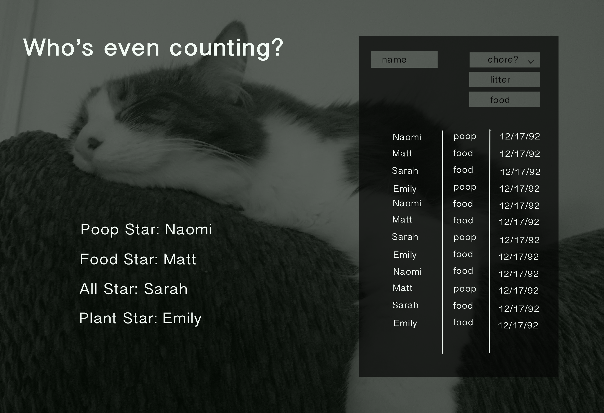

# catChoreApp

This is an expandable app aiming to sort who is doing what cat-related chores in my apartment, with the possibility of expanding to include other genres of chores.

Technologies used: 
* React
* Node.js
* Sinatra/Active Record
* Postgres
* Gulp 
* Less

Aims:
1) Practice using React (increase modularity, incorporate more ES6)
2) Practice implementing tests
3) Provide opportunity for continuous expansion
4) Practice using sql databases and refactoring application when necessary
5) Increase understanding of ORM

